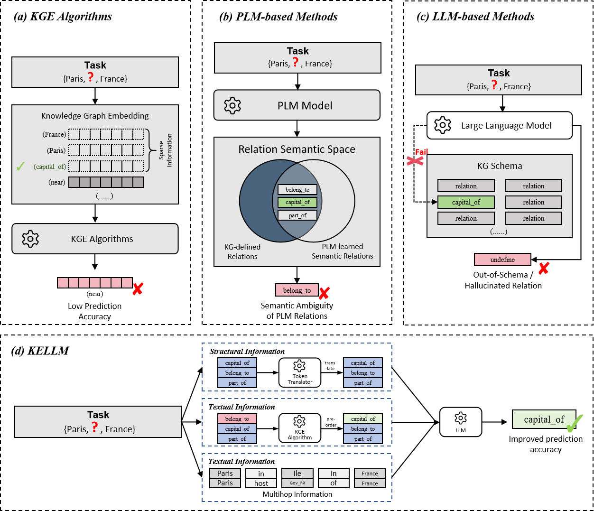

<div align="center">

# 🌌 KELLM: Knowledge Graph Embedding meets Large Language Models for Relation Prediction

[](docs/KGE_Entity_Relation_Prediction.pdf)
[]()
[]()
[]()

</div>

> **A unified structural–semantic framework bridging Knowledge Graph Embeddings and Large Language Models for relation prediction.**

---

<p align="center">
  
</p>

---

## 🧠 Highlights

━━━━━━━━━━━━━━━━━━━━━━━━━━━━━━━━━━━━━━

- **Unified Structural–Semantic Reasoning** — Combines KGE structural priors with LLM semantic inference in a unified sequence space.  
- **Two-Stage Pipeline** — High-recall KGE candidate filtering followed by semantic re-ranking via LLMs.  
- **Token Translator** — Maps continuous embeddings into discrete token sequences for controllable integration.  
- **Multi-hop Expansion** — Explicit multi-hop relational context enhances interpretability and compositional reasoning.  
- **PEFT/LoRA Fine-tuning** — Efficient parameter adaptation preserving strong performance on large-scale graphs.

> KELLM achieves interpretable, scalable reasoning on benchmarks such as FB15k-237, CoDEx-S, and DBpedia50.

---

## ⚙️ Method Overview

━━━━━━━━━━━━━━━━━━━━━━━━━━━━━━━━━━━━━━

KELLM augments a base Large Language Model (LLM) with structured knowledge from a pre-trained Knowledge Graph Embedding (KGE). It translates entity/relation embeddings into a sequence of learnable prefix tokens and injects them in front of text tokens, enabling the LLM to reason over candidate relations conditioned on the head and tail entities.

- **KGE → Token Translator → LLM Prefix Tokens**  
- **LoRA fine-tuning** for efficient adaptation.  
- **Multi-hop reasoning** through textual evidence expansion.

> The model bridges symbolic reasoning and neural representation learning in a single inference loop.

---

## 📦 Repository Layout

━━━━━━━━━━━━━━━━━━━━━━━━━━━━━━━━━━━━━━

```
KELLM/
├─ README.md
├─ docs/
│  ├─ KGE_Entity_Relation_Prediction.pdf
│  └─ figs/
│     └─ kelLM_overview.png
├─ kellm/
└─ configs/
```

---

## 🔧 Environment and Installation

━━━━━━━━━━━━━━━━━━━━━━━━━━━━━━━━━━━━━━

### Requirements
- Python 3.10+  
- CUDA-capable GPU recommended

### Installation
```bash
python -m pip install -r requirements.txt
pip install -e .
```

### Environment variables (optional)
```bash
export PRECISION=auto|bf16|fp16|fp32
export SEED=42
export TORCHDYNAMO_DISABLE=1
export KGE_ENTITY_NPY=/abs/path/to/entity_embedding.npy
export KGE_RELATION_NPY=/abs/path/to/relation_embedding.npy
export TRANSFORMERS_VERBOSITY=error
export HF_HUB_DISABLE_PROGRESS_BARS=1
```

> Precision defaults to auto; DDP and multi-GPU training are fully supported.

---

## 🧩 Dataset Format

━━━━━━━━━━━━━━━━━━━━━━━━━━━━━━━━━━━━━━

Each record is a dictionary compatible with instruction tuning, e.g.:

```json
{
  "instruction": "Predict the relation between entities.",
  "input": {
    "head": "Paris",
    "tail": "France",
    "candidates": ["capital_of", "located_in", "has_population"],
    "paths_text": ["Paris is the capital of France."]
  },
  "output": "capital_of",
  "embedding_ids": [101, 3, 205]
}
```

- Keys: `instruction`, `input`, `output`, `embedding_ids`
- Optional: multi-hop evidence in `paths_text`
- Candidate relations given for contextual ranking.

---

## 🔢 KGE Embeddings

━━━━━━━━━━━━━━━━━━━━━━━━━━━━━━━━━━━━━━

Provide pre-trained `.npy` matrices:
```
entity_embedding.npy     [num_entities, dim]
relation_embedding.npy   [num_relations, dim]
```

Ways to link:
```bash
export KGE_ENTITY_NPY=/abs/path/to/entity_embedding.npy
export KGE_RELATION_NPY=/abs/path/to/relation_embedding.npy
```

Dimension alignment automatically handled (supports RotatE-style `2×` dims).

---

## 🧩 Prefix Construction

━━━━━━━━━━━━━━━━━━━━━━━━━━━━━━━━━━━━━━

`PretrainKGEmbedding` maps IDs to prefix vectors fed to LLMs:

| Input shape | Output shape | Meaning |
|--------------|---------------|----------|
| `[B,3]` | `[B, 3×num_prefix, dim_llm]` | head, relation, tail |
| `[B,L]` | `[B, L×num_prefix, dim_llm]` | multiple entities + relations |
| `[B]` | `[B, num_prefix, dim_llm]` | single entity |

> Invalid IDs are masked to padding (0). Labels for prefix positions are masked (-100).

---

## 🚀 Training

━━━━━━━━━━━━━━━━━━━━━━━━━━━━━━━━━━━━━━

Minimal example:
```bash
python train_kellm.py   --base_model models/Qwen2.5-3B   --data_path CoDEx-S/CoDEx-S_train_with_multihop.json   --valid_data_path CoDEx-S/CoDEx-S_valid_with_multihop.json   --output_dir outputs/CoDEx-S_run   --num_prefix 1 --kge_model CoDEx-S   --model_family qwen --batch_size 128 --micro_batch_size 64   --num_epochs 3 --learning_rate 3e-4
```

Notes:
- LoRA targets vary by model (Qwen uses attention+MLP).  
- Checkpoints save both LoRA weights & embeddings.  
- Early stopping supported via `--use_early_stopping`.

Distributed training:
```bash
torchrun --nproc_per_node 4 train_kellm.py ...
```

> Supports DDP, Accelerate, and automatic accumulation adjustment.

---

## 🔍 Evaluation

━━━━━━━━━━━━━━━━━━━━━━━━━━━━━━━━━━━━━━

Quick start:
```bash
bash eval.sh
```
or manually:
```bash
python evaluation.py   --data_path CoDEx-S/CoDEx-S_test_with_multihop.json   --model_path models/Qwen2.5-3B   --adapter_path outputs/<run>/checkpoint-*   --template alpaca --max_new_tokens 128   --dtype fp16 --save_predictions outputs/eval/predictions.jsonl
```

Evaluation details:
- Auto-detects GPUs & shards workloads.  
- Produces JSONL predictions & summary metrics (MRR, Hits@K).  
- Diagnostics include sequence lengths, OOV rate, parse-mode stats.

---

## 💻 Inference (Programmatic)

━━━━━━━━━━━━━━━━━━━━━━━━━━━━━━━━━━━━━━

```python
from transformers import AutoModelForCausalLM, AutoTokenizer
from kellm import KELLMWithTokenTranslator
import torch

tok = AutoTokenizer.from_pretrained("models/Qwen2.5-3B", trust_remote_code=True)
mdl = AutoModelForCausalLM.from_pretrained("models/Qwen2.5-3B", trust_remote_code=True)

kellm = KELLMWithTokenTranslator(model=mdl, num_prefix=1, kge_model="CoDEx-S")

prompt = "Predict the relation ..."
enc = tok(prompt, return_tensors="pt")
eid = torch.tensor([[head_id, tail_id, *candidate_rel_ids]], dtype=torch.long)

gen = kellm.generate(input_ids=enc["input_ids"], embedding_ids=eid, max_new_tokens=128)
print(tok.decode(gen[0], skip_special_tokens=True))
```

---

## ⚙️ Configuration Reference

━━━━━━━━━━━━━━━━━━━━━━━━━━━━━━━━━━━━━━

Important args (`train_kellm.py`):
- `--base_model`, `--data_path`, `--valid_data_path`
- `--num_prefix`, `--kge_model`, `--model_family`
- LoRA: `--lora_r`, `--lora_alpha`, `--lora_dropout`
- Early stopping: `--use_early_stopping`, `--metric_for_best_model`

Evaluation args (`evaluation.py`):
- `--data_path`, `--model_path`, `--adapter_path`
- `--dtype`, `--batch_size`, `--auto_shard`, `--save_predictions`

---

## 📈 Reproducing Experiments (CoDEx-S)

━━━━━━━━━━━━━━━━━━━━━━━━━━━━━━━━━━━━━━

1️⃣ Prepare KGE  
```bash
export KGE_ENTITY_NPY=/abs/path/to/entity_embedding.npy
export KGE_RELATION_NPY=/abs/path/to/relation_embedding.npy
```

2️⃣ Train  
```bash
python train_kellm.py   --base_model models/Qwen2.5-3B   --data_path CoDEx-S/CoDEx-S_train_with_multihop.json   --valid_data_path CoDEx-S/CoDEx-S_valid_with_multihop.json   --output_dir outputs/CoDEx-S_$(date +%F_%H-%M-%S)   --num_prefix 1 --kge_model CoDEx-S --model_family qwen
```

3️⃣ Evaluate  
```bash
bash eval.sh
```

> Metrics include MRR, Hits@1,3,10, and Gold-in-Candidates rate.

---

## 🧭 Troubleshooting

━━━━━━━━━━━━━━━━━━━━━━━━━━━━━━━━━━━━━━

- **Dtype/device mismatch** — ensure embeddings and model share dtype.  
- **Prefix length errors** — verify `embedding_ids` padding shape.  
- **Gold missing** — check data preprocessing consistency.  
- **PyTorch ≥2.6** — safe loading enforced for `embeddings.pth`.

---

## ❓ FAQ

━━━━━━━━━━━━━━━━━━━━━━━━━━━━━━━━━━━━━━

**Q:** Can I use `[B,3]` ids at inference?  
**A:** Yes, for candidate ranking or single-triple conditioning.

**Q:** How many prefix tokens per id?  
**A:** Start with 1 for efficiency; scales linearly.

**Q:** Do I need internet to load models?  
**A:** No, all models are local.

---

## 📘 Paper and Citation

━━━━━━━━━━━━━━━━━━━━━━━━━━━━━━━━━━━━━━

📄 **Full paper (EDBT 2026):** [Download PDF](docs/KGE_Entity_Relation_Prediction.pdf)

If you use this repository or the accompanying paper in your research, please cite:

```bibtex
@inproceedings{Wu2026KELLM,
  title     = {KELLM: Knowledge Graph Embedding meets Large Language Models for Relation Prediction},
  author    = {Siyan Wu and Chenghua Zhu and Lihua Cai},
  booktitle = {Proceedings of the 29th International Conference on Extending Database Technology (EDBT)},
  year      = {2026}
}
```

---

## ⚖️ License

━━━━━━━━━━━━━━━━━━━━━━━━━━━━━━━━━━━━━━

This repository is released under the **Apache 2.0 License**.  
You are free to use, modify, and distribute the work with appropriate attribution.

---

## 🧩 Acknowledgements

━━━━━━━━━━━━━━━━━━━━━━━━━━━━━━━━━━━━━━

> This work builds upon open-source implementations of TransE, DistMult, ComplEx, and RotatE for KGE,  
> as well as PEFT/LoRA fine-tuning frameworks from the Hugging Face ecosystem.

<div align="center">

**© 2026 — KELLM Project | Research Code Release**  
Made with ❤️ for the academic community.

[🔝 Back to Top](#kellm-knowledge-graph-embedding-meets-large-language-models-for-relation-prediction)

</div>
