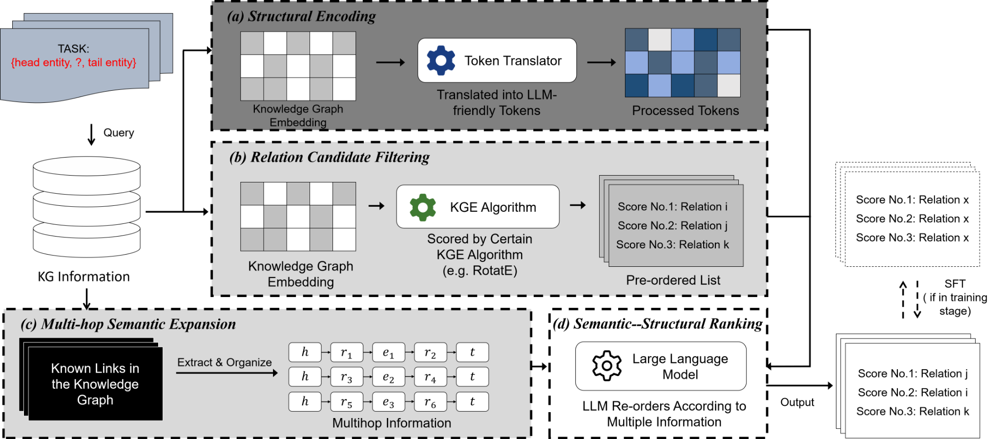
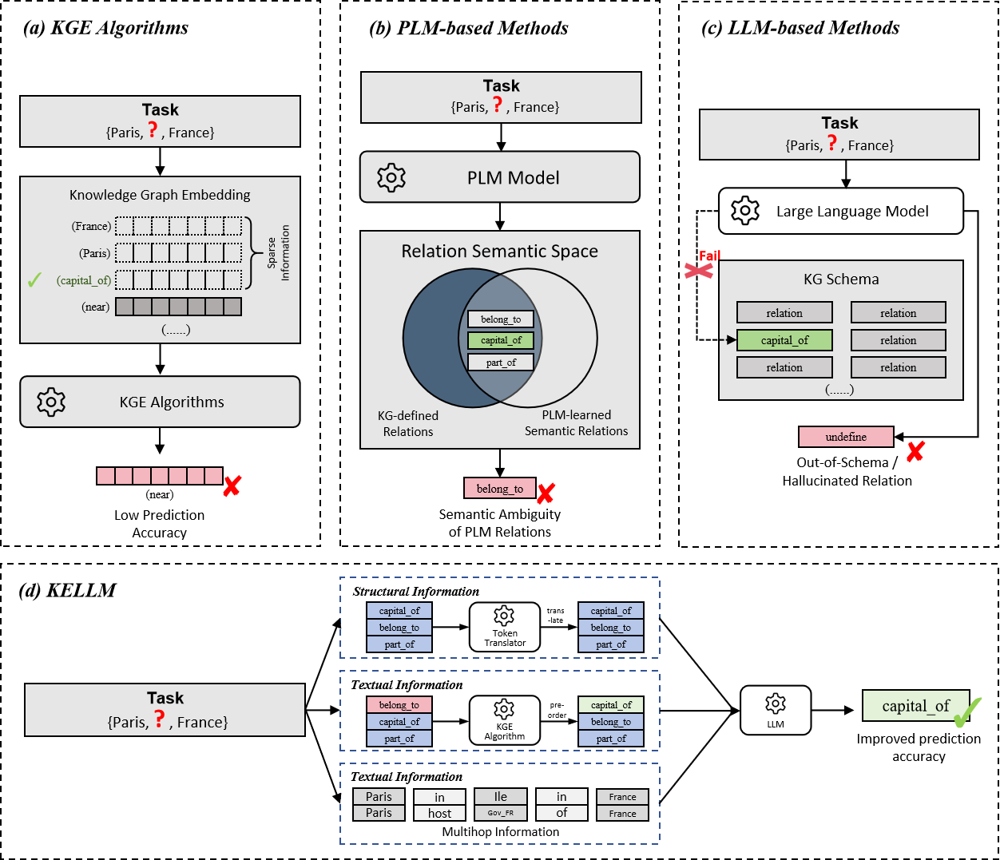

# 🌌 KELLM: Knowledge-Enhanced Language Learning Model

> **KELLM** integrates knowledge graph reasoning with large language modeling, enabling deeper semantic understanding and relation prediction across complex entity spaces.  
> This repository provides the implementation, evaluation, and documentation for KELLM.

---

## 🧠 Overview

<div align="center">
  
  
</div>

---

## 📁 Repository Structure

> The project follows a clear modular organization.  
> All essential scripts and resources are listed below for reference.

```
KELLM/
├─ README.md
├─ CoDEx-S/                     # Example / benchmark datasets & configs
├─ docs/
│  ├─ KGE_Entity_Relation_Prediction.pdf
│  └─ figs/
│     ├─ kelLM_overview_1.png
│     └─ kelLM_overview_2.png
├─ utils/                       # Helper scripts and utilities
├─ train_kellm.py               # Main training entry
├─ evaluation.py                # Evaluation pipeline
├─ kellm.py                     # Core implementation of KELLM
├─ kge.py                       # Knowledge Graph Embedding I/O module
├─ train.sh                     # Quick-start training shell
├─ eval.sh                      # Quick-start evaluation shell
├─ requirements.txt             # Dependencies
└─ .gitattributes
```

> **Note:** The structure reflects the latest layout in the `main` branch.  
> Folders such as `kellm/` or `configs/` seen in early drafts are no longer present.

---

## ⚙️ Model Weights

This repository does **not** include pretrained LLM or KGE weights.  
Please prepare them manually before training or inference.

You may obtain compatible models from the official **[Hugging Face Hub](https://huggingface.co/)** —  
search for your desired base model and download according to task requirements.

---

## 📄 Documentation

The detailed paper is available in `docs/KGE_Entity_Relation_Prediction.pdf`.  
All figures are located in `docs/figs/`.

---

## 🧩 Citation

If you find this work useful, please consider citing:

```
@article{kelLM2025,
  title   = {KELLM: Knowledge-Enhanced Language Learning Model for Entity–Relation Prediction},
  author  = {TheBlueBanisters et al.},
  journal = {Under Review, 2025},
  year    = {2025}
}
```

---

## 🌐 License

This repository is distributed under the **MIT License**.  
See `LICENSE` for details.
